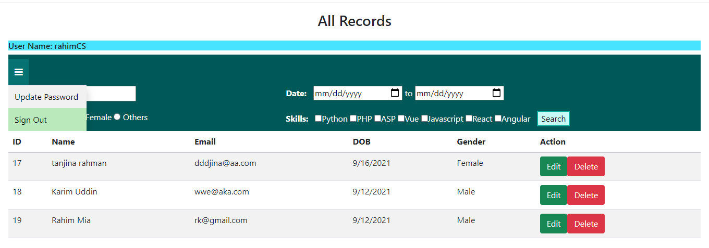
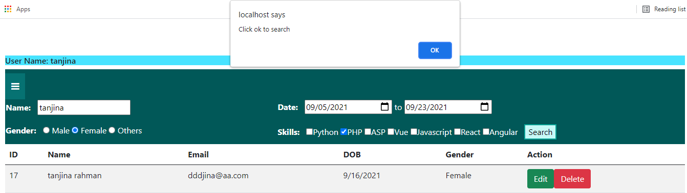
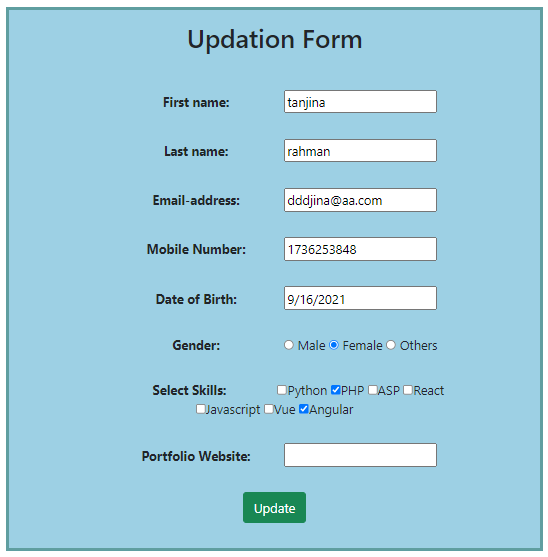
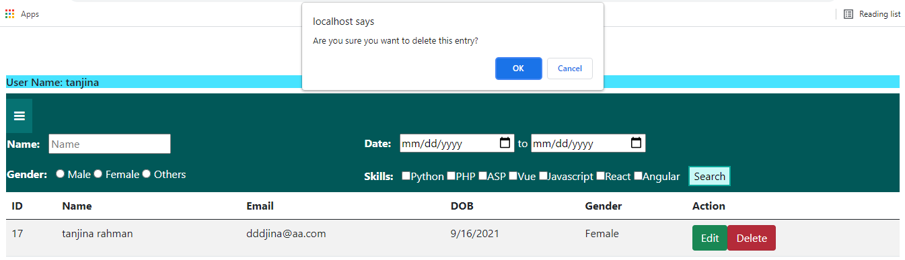

# Project_I 
(A Web Based Project)

### Introduction
This is a very simple project that includes sign in, sign up, sign out, CRUD operations as well as search.

### Tools
- Code Editor: Visual Studio Code
- Database: Microsoft Access (2002-03)
- Language: VBScript
- Ajax
- jquery 3.2.1
- Javascript

### Work Flow
The Workflow of this project is attached here -  

  

Fig 1.1: Work Flow

### Description
#### Sign In
Before sign in, you need to signup using User Name and Password. If you try to sign in before sign up then you will get alert that user name doesn't exists! And you will also get alert for incorrect password. 

  

Fig 2.1: Sign In
  

#### Sign Up
At first, you have to sign up, otherwise, you'll not be able to sign in. For this, you have to set a unique user name and password. Don't worry. If your username already exists, then you will not be able to submit the form and you will get a message "User name already exists!" just below of User Name field.

  

Fig 3.1: Sign Up
  
After signing up, you will need to fill out a form that will contain detailed information about you. After filling this form, you need to sign in.  

  

Fig 3.2: Detailed Informations
  

#### Display
In this page, all records will be displayed. On left top side, your user name will be displayed. There is a menu bar from where you can sign out. Remember that after log out, your session and cookies will be destroyed, so you'll not be able to see records. You have to sign in again.  

  

Fig 4.1: Records
  
There are also search, edit and delete buttons.

#### Search
You can search by name, gender, date and skills only or together. After clicking “Search” button an alert will be shown and you need to click ok to search. Search operation has been implemented using Ajax. So, searched items will be displayed without loading the page.  

  

Fig 5.1: Search
  

#### Edit
You can update information details using the edit button. After clicking on the Edit button a form will be displayed with existing data and you can edit the form and submit again.  

  

Fig 6.1: Edit
  

#### Delete
You can delete your account by clicking on the delete button. After clicking the delete button an alert will be shown and you can delete by clicking ok or cancel it as well.  

  

Fig 7.1: Delete
  
As Ajax is used on delete operation, the row will be deleted without loading the page.

### Outcome/ Learnings:
We have -
-	Learnt VBScript and MS Access Database.
-	Used almost all types of HTML input, store their values in database as well as displayed data into forms by retrieving data from database.
-	Implemented search operation using Ajax and learnt to handle query in a dynamic way.
-	Learnt about session and cookies.
-	Learnt about server side and client side verification and send alert from backend to front end.
-	Moreover, we have learnt to handle a project in a smart way.
